# JPEG test images

| Name                                     | Description                                                                                                                                           | Actual JPEG                                                                                   | Expected Image                                                                                | Expected Object                                   |
| ---------------------------------------- | ----------------------------------------------------------------------------------------------------------------------------------------------------- | --------------------------------------------------------------------------------------------- | --------------------------------------------------------------------------------------------- | ------------------------------------------------- |
| 8x8                                      | JFIF image without subsampling (Quality 90, Optimized, No Smoothing, No Subsampling, Floating point baseline DCT).                                    |                                                                            |                                                                            | [TS](8x8.ts)                                      |
| 8x8-cmyk                                 | `convert original/8x8.png -colorspace cmyk 8x8-cmyk.jpg`                                                                                              | 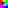                                                                 | ⚠️ Unsupported color space                                                                    | [TS](8x8-cmyk.ts)                                 |
| 8x8-gray                                 | `convert original/8x8.png -colorspace gray 8x8-gray.jpg`                                                                                              | 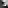                                                                 | ⚠️ Unsupported color space                                                                    | [TS](8x8-gray.ts)                                 |
| 8x8-with-thumbnail                       | Same as 8x8.jpg but with thumbnail.                                                                                                                   |                                              |                                              | [TS](8x8-with-thumbnail.ts)                       |
| 7x11                                     | JFIF image without subsampling (Quality 80, Optimized, No Smoothing, No Subsampling, Floating point baseline DCT).                                    |                                                                          |                                                                          | [TS](7x11.ts)                                     |
| 11x7                                     | JFIF image without subsampling (Quality 80, Optimized, No Smoothing, No Subsampling, Floating point baseline DCT).                                    | 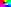                                                                         |                                                                          | [TS](11x7.ts)                                     |
| 8x16                                     | JFIF image with subsampling for Cb and Cr component (Quality 90, Optimized, No Smoothing, Subsampling 4:2:2 vertical, Floating point baseline DCT).   |                                                                          | 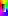                                                                         | [TS](8x16.ts)                                     |
| 16x8                                     | JFIF image with subsampling for Cb and Cr component (Quality 90, Optimized, No Smoothing, Subsampling 4:2:2 horizontal, Floating point baseline DCT). |                                                                          | 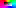                                                                         | [TS](16x8.ts)                                     |
| 16x16                                    | JFIF image without subsampling and 2x2 MCUs (Quality 90, Optimized, No Smoothing, Floating point baseline DCT).                                       | 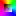                                                                       |                                                                        | [TS](16x16.ts)                                    |
| 32x32-subsampling-221221-mcu-2x2         | JFIF image with subsampling and 2x2 MCUs (Quality 90, Optimized, No Smoothing, Subsampling 2x2,1x2,2x1, Floating point baseline DCT).                 |                  |                  | [TS](32x32-subsampling-221221-mcu-2x2.ts)         |
| 35x35-subsampling-122111-partial-mcu-3x3 | JFIF image with subsampling and cropped 3x3 MCUs (Quality 90, Optimized, No Smoothing, Subsampling 1x2,2x1,1x1, Floating point baseline DCT).         |  | 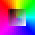 | [TS](35x35-subsampling-122111-partial-mcu-3x3.ts) |
| 32x32                                    | JFIF image without subsampling (Quality 80, Optimized, No Smoothing, No Subsampling, Floating point baseline DCT).                                    |                                                                        |                                                                        | [TS](32x32.ts)                                    |
| subsampling-8x16-121111                  | RGB image with subsampling 1x2,1x1,1x1 and single MCU (Quality 85, Optimized, Floating point baseline DCT).                                           |                                    |                                    | [TS](subsampling-8x16-121111.ts)                  |
| subsampling-16x8-211111                  | RGB image with subsampling 2x1,1x1,1x1 and single MCU (Quality 85, Optimized, Floating point baseline DCT).                                           |                                    | 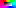                                   | [TS](subsampling-16x8-211111.ts)                  |
| subsampling-24x8-111131                  | RGB image with subsampling 1x1,1x1,3x1 and single MCU (Quality 85, Optimized, Floating point baseline DCT).                                           |                                    |                                    | [TS](subsampling-24x8-111131.ts)                  |
| subsampling-8x16-121211                  | RGB image with subsampling 1x2,1x2,1x1 and single MCU (Quality 85, Optimized, Floating point baseline DCT).                                           |                                    |                                    | [TS](subsampling-8x16-121211.ts)                  |
| subsampling-16x16-221111                 | RGB image with subsampling 2x2,1x1,1x1 and single MCU (Quality 85, Optimized, Floating point baseline DCT).                                           | 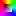                                 | 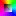                                 | [TS](subsampling-16x16-221111.ts)                 |
| subsampling-32x8-411111                  | RGB image with subsampling 4x1,1x1,1x1 and single MCU (Quality 85, Optimized, Floating point baseline DCT).                                           |                                    |                                    | [TS](subsampling-32x8-411111.ts)                  |
| subsampling-24x16-111231                 | RGB image with subsampling 1x1,1x2,3x1 and single MCU (Quality 85, Optimized, Floating point baseline DCT).                                           | 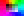                                 | 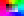                                 | [TS](subsampling-24x16-111231.ts)                 |
| subsampling-8x16-121212                  | RGB image with subsampling 1x2,1x2,1x2 and single MCU (Quality 85, Optimized, Floating point baseline DCT).                                           | 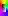                                   |                                    | [TS](subsampling-8x16-121212.ts)                  |
| subsampling-32x8-114121                  | RGB image with subsampling 1x1,4x1,2x1 and single MCU (Quality 85, Optimized, Floating point baseline DCT).                                           |                                    |                                    | [TS](subsampling-32x8-114121.ts)                  |
| subsampling-16x16-212211                 | RGB image with subsampling 2x1,2x2,1x1 and single MCU (Quality 85, Optimized, Floating point baseline DCT).                                           | 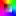                                 |                                  | [TS](subsampling-16x16-212211.ts)                 |
| subsampling-8x24-131311                  | RGB image with subsampling 1x3,1x3,1x1 and single MCU (Quality 85, Optimized, Floating point baseline DCT).                                           |                                    | 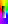                                   | [TS](subsampling-8x24-131311.ts)                  |
| subsampling-24x16-113211                 | RGB image with subsampling 1x1,3x2,1x1 and single MCU (Quality 85, Optimized, Floating point baseline DCT).                                           |                                  | 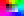                                 | [TS](subsampling-24x16-113211.ts)                 |
| subsampling-24x32-311114                 | RGB image with subsampling 3x1,1x1,1x4 and single MCU (Quality 85, Optimized, Floating point baseline DCT).                                           |                                  | 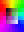                                 | [TS](subsampling-24x32-311114.ts)                 |
| subsampling-8x32-121214                  | RGB image with subsampling 1x2,1x2,1x4 and single MCU (Quality 85, Optimized, Floating point baseline DCT).                                           |                                    |                                    | [TS](subsampling-8x32-121214.ts)                  |
| subsampling-16x16-212212                 | RGB image with subsampling 2x1,2x2,1x2 and single MCU (Quality 85, Optimized, Floating point baseline DCT).                                           |                                  |                                  | [TS](subsampling-16x16-212212.ts)                 |
| subsampling-24x16-311231                 | RGB image with subsampling 3x1,1x2,3x1 and single MCU (Quality 85, Optimized, Floating point baseline DCT).                                           | 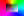                                 |                                  | [TS](subsampling-24x16-311231.ts)                 |
| subsampling-24x16-121132                 | RGB image with subsampling 1x2,1x1,3x2 and single MCU (Quality 85, Optimized, Floating point baseline DCT).                                           | 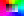                                 |                                  | [TS](subsampling-24x16-121132.ts)                 |
| subsampling-32x32-111441                 | RGB image with subsampling 1x1,1x4,4x1 and single MCU (Quality 85, Optimized, Floating point baseline DCT).                                           |                                  | 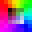                                 | [TS](subsampling-32x32-111441.ts)                 |
| subsampling-32x16-221141                 | RGB image with subsampling 2x2,1x1,4x1 and single MCU (Quality 85, Optimized, Floating point baseline DCT).                                           |                                  | 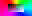                                 | [TS](subsampling-32x16-221141.ts)                 |
| subsampling-16x16-222211                 | RGB image with subsampling 2x2,2x2,1x1 and single MCU (Quality 85, Optimized, Floating point baseline DCT).                                           |                                  | 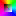                                 | [TS](subsampling-16x16-222211.ts)                 |
| subsampling-24x24-131331                 | RGB image with subsampling 1x3,1x3,3x1 and single MCU (Quality 85, Optimized, Floating point baseline DCT).                                           | 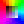                                 |                                  | [TS](subsampling-24x24-131331.ts)                 |
| subsampling-16x32-241111                 | RGB image with subsampling 2x4,1x1,1x1 and single MCU (Quality 85, Optimized, Floating point baseline DCT).                                           |                                  |                                  | [TS](subsampling-16x32-241111.ts)                 |
| subsampling-16x24-112313                 | RGB image with subsampling 1x1,2x3,1x3 and single MCU (Quality 85, Optimized, Floating point baseline DCT).                                           | 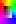                                 | 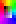                                 | [TS](subsampling-16x24-112313.ts)                 |
| subsampling-24x16-121232                 | RGB image with subsampling 1x2,1x2,3x2 and single MCU (Quality 85, Optimized, Floating point baseline DCT).                                           |                                  |                                  | [TS](subsampling-24x16-121232.ts)                 |
| subsampling-16x32-211414                 | RGB image with subsampling 2x1,1x4,1x4 and single MCU (Quality 85, Optimized, Floating point baseline DCT).                                           |                                  | 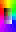                                 | [TS](subsampling-16x32-211414.ts)                 |
| subsampling-32x16-222141                 | RGB image with subsampling 2x2,2x1,4x1 and single MCU (Quality 85, Optimized, Floating point baseline DCT).                                           | 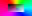                                 |                                  | [TS](subsampling-32x16-222141.ts)                 |
| subsampling-16x16-212222                 | RGB image with subsampling 2x1,2x2,2x2 and single MCU (Quality 85, Optimized, Floating point baseline DCT).                                           |                                  |                                  | [TS](subsampling-16x16-212222.ts)                 |
| subsampling-gray-16x8-21                 | Gray image with subsampling 2x1 and single MCU (Quality 85, Optimized, Floating point baseline DCT).                                                  |                                  | ⚠️ Unsupported color space                                                                    | [TS](subsampling-gray-16x8-21.ts)                 |
| subsampling-gray-8x24-13                 | Gray image with subsampling 1x3 and single MCU (Quality 85, Optimized, Floating point baseline DCT).                                                  | 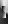                                 | ⚠️ Unsupported color space                                                                    | [TS](subsampling-gray-8x24-13.ts)                 |
| subsampling-gray-8x32-14                 | Gray image with subsampling 1x4 and single MCU (Quality 85, Optimized, Floating point baseline DCT).                                                  |                                  | ⚠️ Unsupported color space                                                                    | [TS](subsampling-gray-8x32-14.ts)                 |
| subsampling-gray-16x16-22                | Gray image with subsampling 2x2 and single MCU (Quality 85, Optimized, Floating point baseline DCT).                                                  | 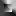                               | ⚠️ Unsupported color space                                                                    | [TS](subsampling-gray-16x16-22.ts)                |
| subsampling-gray-16x24-23                | Gray image with subsampling 2x3 and single MCU (Quality 85, Optimized, Floating point baseline DCT).                                                  | 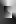                               | ⚠️ Unsupported color space                                                                    | [TS](subsampling-gray-16x24-23.ts)                |
| subsampling-gray-16x32-24                | Gray image with subsampling 2x4 and single MCU (Quality 85, Optimized, Floating point baseline DCT).                                                  | 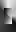                               | ⚠️ Unsupported color space                                                                    | [TS](subsampling-gray-16x32-24.ts)                |
| subsampling-gray-24x24-33                | Gray image with subsampling 3x3 and single MCU (Quality 85, Optimized, Floating point baseline DCT).                                                  |                                | ⚠️ Unsupported color space                                                                    | [TS](subsampling-gray-24x24-33.ts)                |
| subsampling-cmyk-16x8-11111121           | CMYK image with subsampling 1x1,1x1,1x1,2x1 and single MCU (Quality 85, Optimized, Floating point baseline DCT).                                      | 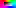                     | ⚠️ Unsupported color space                                                                    | [TS](subsampling-cmyk-16x8-11111121.ts)           |
| subsampling-cmyk-24x8-11113111           | CMYK image with subsampling 1x1,1x1,3x1,1x1 and single MCU (Quality 85, Optimized, Floating point baseline DCT).                                      |                      | ⚠️ Unsupported color space                                                                    | [TS](subsampling-cmyk-24x8-11113111.ts)           |
| subsampling-cmyk-16x16-11121121          | CMYK image with subsampling 1x1,1x2,1x1,2x1 and single MCU (Quality 85, Optimized, Floating point baseline DCT).                                      | 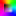                   | ⚠️ Unsupported color space                                                                    | [TS](subsampling-cmyk-16x16-11121121.ts)          |
| subsampling-cmyk-8x32-11141111           | CMYK image with subsampling 1x1,1x4,1x1,1x1 and single MCU (Quality 85, Optimized, Floating point baseline DCT).                                      |                      | ⚠️ Unsupported color space                                                                    | [TS](subsampling-cmyk-8x32-11141111.ts)           |
| subsampling-cmyk-16x16-22111111          | CMYK image with subsampling 2x2,1x1,1x1,1x1 and single MCU (Quality 85, Optimized, Floating point baseline DCT).                                      |                    | ⚠️ Unsupported color space                                                                    | [TS](subsampling-cmyk-16x16-22111111.ts)          |
| subsampling-cmyk-16x16-11211212          | CMYK image with subsampling 1x1,2x1,1x2,1x2 and single MCU (Quality 85, Optimized, Floating point baseline DCT).                                      | 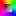                   | ⚠️ Unsupported color space                                                                    | [TS](subsampling-cmyk-16x16-11211212.ts)          |
| subsampling-cmyk-32x8-21411111           | CMYK image with subsampling 2x1,4x1,1x1,1x1 and single MCU (Quality 85, Optimized, Floating point baseline DCT).                                      |                      | ⚠️ Unsupported color space                                                                    | [TS](subsampling-cmyk-32x8-21411111.ts)           |
| subsampling-cmyk-16x16-22112111          | CMYK image with subsampling 2x2,1x1,2x1,1x1 and single MCU (Quality 85, Optimized, Floating point baseline DCT).                                      |                    | ⚠️ Unsupported color space                                                                    | [TS](subsampling-cmyk-16x16-22112111.ts)          |
| subsampling-cmyk-24x8-11311131           | CMYK image with subsampling 1x1,3x1,1x1,3x1 and single MCU (Quality 85, Optimized, Floating point baseline DCT).                                      |                      | ⚠️ Unsupported color space                                                                    | [TS](subsampling-cmyk-24x8-11311131.ts)           |
| subsampling-cmyk-16x16-21122121          | CMYK image with subsampling 2x1,1x2,2x1,2x1 and single MCU (Quality 85, Optimized, Floating point baseline DCT).                                      | 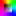                   | ⚠️ Unsupported color space                                                                    | [TS](subsampling-cmyk-16x16-21122121.ts)          |
| subsampling-cmyk-16x24-11231111          | CMYK image with subsampling 1x1,2x3,1x1,1x1 and single MCU (Quality 85, Optimized, Floating point baseline DCT).                                      | 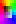                   | ⚠️ Unsupported color space                                                                    | [TS](subsampling-cmyk-16x24-11231111.ts)          |
| subsampling-cmyk-16x32-12112114          | CMYK image with subsampling 1x2,1x1,2x1,1x4 and single MCU (Quality 85, Optimized, Floating point baseline DCT).                                      |                    | ⚠️ Unsupported color space                                                                    | [TS](subsampling-cmyk-16x32-12112114.ts)          |
| subsampling-cmyk-16x16-22121121          | CMYK image with subsampling 2x2,1x2,1x1,2x1 and single MCU (Quality 85, Optimized, Floating point baseline DCT).                                      |                    | ⚠️ Unsupported color space                                                                    | [TS](subsampling-cmyk-16x16-22121121.ts)          |
| subsampling-cmyk-24x16-11321211          | CMYK image with subsampling 1x1,3x2,1x2,1x1 and single MCU (Quality 85, Optimized, Floating point baseline DCT).                                      | 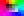                   | ⚠️ Unsupported color space                                                                    | [TS](subsampling-cmyk-24x16-11321211.ts)          |
| subsampling-cmyk-32x32-41111114          | CMYK image with subsampling 4x1,1x1,1x1,1x4 and single MCU (Quality 85, Optimized, Floating point baseline DCT).                                      | 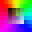                   | ⚠️ Unsupported color space                                                                    | [TS](subsampling-cmyk-32x32-41111114.ts)          |
| subsampling-cmyk-16x32-11141122          | CMYK image with subsampling 1x1,1x4,1x1,2x2 and single MCU (Quality 85, Optimized, Floating point baseline DCT).                                      | 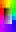                   | ⚠️ Unsupported color space                                                                    | [TS](subsampling-cmyk-16x32-11141122.ts)          |
| subsampling-cmyk-16x16-22221111          | CMYK image with subsampling 2x2,2x2,1x1,1x1 and single MCU (Quality 85, Optimized, Floating point baseline DCT).                                      |                    | ⚠️ Unsupported color space                                                                    | [TS](subsampling-cmyk-16x16-22221111.ts)          |
| subsampling-cmyk-32x24-13412111          | CMYK image with subsampling 1x3,4x1,2x1,1x1 and single MCU (Quality 85, Optimized, Floating point baseline DCT).                                      | 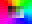                   | ⚠️ Unsupported color space                                                                    | [TS](subsampling-cmyk-32x24-13412111.ts)          |
| subsampling-cmyk-24x24-11313113          | CMYK image with subsampling 1x1,3x1,3x1,1x3 and single MCU (Quality 85, Optimized, Floating point baseline DCT).                                      | 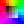                   | ⚠️ Unsupported color space                                                                    | [TS](subsampling-cmyk-24x24-11313113.ts)          |
| subsampling-cmyk-16x32-21211214          | CMYK image with subsampling 2x1,2x1,1x2,1x4 and single MCU (Quality 85, Optimized, Floating point baseline DCT).                                      | 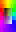                   | ⚠️ Unsupported color space                                                                    | [TS](subsampling-cmyk-16x32-21211214.ts)          |
| subsampling-cmyk-16x16-21212212          | CMYK image with subsampling 2x1,2x1,2x2,1x2 and single MCU (Quality 85, Optimized, Floating point baseline DCT).                                      | 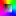                   | ⚠️ Unsupported color space                                                                    | [TS](subsampling-cmyk-16x16-21212212.ts)          |
| 8x8-fill-bytes-before-soi                | Same as 8x8.jpg but with fill bytes before SOI marker.                                                                                                |                                |                                                                                               | ⚠️ Invalid JPEG                                   |
| data-after-eoi                           | Some data after EOI marker.                                                                                                                           |                                                      |                                                      | [TS](data-after-eoi.ts)                           |
| arithmetic-coding                        | Image using arithmetic coding.                                                                                                                        |                                                | ⚠️ Unsupported arithmetic coding                                                              | [TS](arithmetic-coding.ts)                        |
| progressive                              | Image using progressive frame.                                                                                                                        |                                                            | ⚠️ Unsupported progressive JPEG                                                               | [TS](progressive.ts)                              |
| restart-interval-4                       | Using restart markers with interval 4.                                                                                                                |                                              | 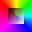                                             | [TS](restart-interval-4.ts)                       |
| restart-interval-8                       | Using restart markers with interval 8.                                                                                                                |                                              |                                              | [TS](restart-interval-8.ts)                       |
| restart-interval-12                      | Using restart markers with interval 12.                                                                                                               |                                            |                                            | [TS](restart-interval-12.ts)                      |
